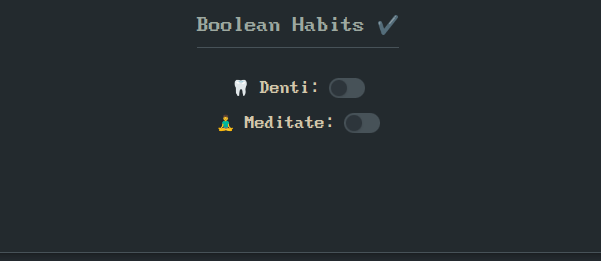
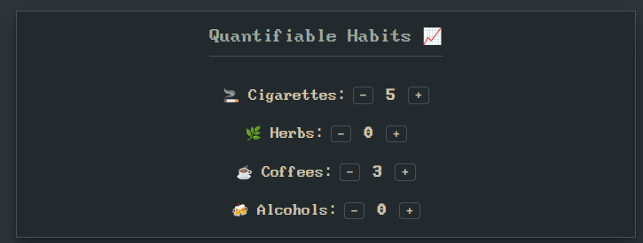
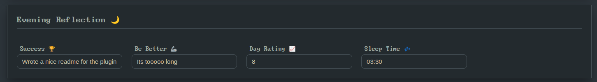

# SQLite DB Plugin

The **SQLite DB Plugin** allows you to interact with SQLite databases directly within your Obsidian vault. You can execute SQL queries, generate charts from your data, inspect table structures, and even export table rows as notes.

---

## Features

- **SQL Query Execution**  
  Write SQL queries in code blocks to fetch and render data from your SQLite database.
- **Natural Results Rendering**  
  See query results rendered as natural lists or in a custom format directly in your note.
- **Multiple Filters & Date Range Filtering**  
  Easily add multiple filter conditions and date ranges to your queries.
- **Chart Visualization**  
  Use the `sql-chart` code block to create charts (pie, line, or bar) based on your data.
- **Table Inspection & Data Export**  
  Inspect table structures and export table rows to new notes.

---

## Configuration

Once the plugin is installed, open Settings → SQLite DB Plugin to configure it.
You can choose to work with either a local database file or a remote API, and optionally integrate with your daily notes or Cloudflare Access for secure API access.

🔀 Database Mode
Choose whether the plugin interacts with a local SQLite file or a remote API server.

📁 Local Mode Settings
Used when Database mode is set to Local. Here you can set your full absolute path to your .db SQLite file

🌐 Remote Mode Settings
Used when Database mode is set to Remote.
Ideal for syncing across devices or accessing a shared dataset via HTTP.

If you protect your API using Cloudflare Access, provide your Client ID and Client Secret here for automatic token-based login.

🗓️ Journal Settings
These options help the plugin locate and manage your journal entries if you have some. This + the commands registered in the plugin allows you to dump the entries in your db into the folder or the other way round, upsert the journal you wrote in obsidian into your own DB.

This as other parts of the plugin requires you to setup a specific database schema for the tables

---

## Usage

### Codeblocks

#### SQL Code Blocks

Create a code block labeled with `sql` to run a SQL query. For example:

```sql
table: Tasks
columns: text, completed, due
filterColumn: completed, priority
filterValue: 0, high
dateColumn: due
startDate: 2024-01-01
endDate: 2024-12-31
orderBy: due
orderDirection: asc
limit: 10
```

This query will:

- Select the `text`, `completed`, and `due` columns from the `Tasks` table.
- Apply two filters: one on `completed` and another on `priority`.
- Filter rows within the specified date range.
- Order the result by the `due` column in ascending order.
- Limit the number of rows to 10.

Below is a list of available parameters you can use in your SQL blocks:

| Parameter       | Description                                                         | Example                           |
| --------------- | ------------------------------------------------------------------- | --------------------------------- |
| `table`         | **Required.** Name of the table to query.                           | `table: Tasks`                    |
| `columns`       | Comma-separated columns to select.                                  | `columns: id, text, due`            |
| `filterColumn`  | Column(s) to filter on. Can list multiple columns separated by commas.| `filterColumn: completed, priority` |
| `filterValue`   | Filter value(s) for the corresponding columns in `filterColumn`.      | `filterValue: 0, high`              |
| `dateColumn`    | Column containing date information for range filtering.             | `dateColumn: due`                 |
| `startDate`     | Starting date for filtering.                                          | `startDate: 2024-01-01`             |
| `endDate`       | Ending date for filtering.                                            | `endDate: 2024-12-31`               |
| `orderBy`       | Column to order the results by.                                       | `orderBy: due`                    |
| `orderDirection`| Direction of sort (`asc` or `desc`).                                  | `orderDirection: asc`             |
| `limit`         | Maximum number of rows to return.                                     | `limit: 10`                     

#### Chart Code Blocks

Create a code block labeled with `sql-chart` for visualizations. For example:

```sql-chart
table: Time
chartType: pie
categoryColumn: tag
valueColumn: duration
```


**Parameters**

| Parameter       | Description                                                         | Example                           |
| --------------- | ------------------------------------------------------------------- | --------------------------------- |
| `chartType`     | Type of chart to create.                                           | `chartType: pie`                    |
| `categoryColumn`| Column to use for the category in the chart.                      | `categoryColumn: priority`         |
| `valueColumn`   | Column to use for the value in the chart.                          | `valueColumn: completed`            |

Each chart takes an optional chartOptions object that can be used to customize the different chart types:

**Chart types**

```sql-chart

table: QuantifiableHabits
chartType: line

xColumn: date
yColumns: value
categoryColumn: habitKey

dateColumn: date
startDate: 2025-01-01
endDate: 2025-01-31

chartOptions: {
	fill: false,
	tension: 0.5,
	pointRadius: 4,
	showLegend: true,
	animations: true,
	yAxisMin: 0,
	yAxisMax: 10
}

```


```sql-chart
table: QuantifiableHabits
chartType: bar

xColumn: date
yColumns: value
categoryColumn: habitKey

dateColumn: date
startDate: 2025-01-01
endDate: 2025-01-31

chartOptions: {
    stacked: true,
    horizontal: false,
    showLegend: true,
    animations: true,
    tooltips: true
}
```

```sql-chart

table: Money
chartType: pie

categoryColumn: tag
valueColumn: amount

dateColumn: date
startDate: 2025-01-01
endDate: 2025-01-31

chartOptions: {
	showLegend: true,
	isDoughnut: true
}
```

### Interactive Components

The plugin supports custom interactive HTML components you can embed in your notes to view and update data live. These components are initialized at runtime using your database settings.
I wrote these to create interactive Periodic Notes, and update data in them accordingly

#### Boolean Switch

Use the <boolean-switch> component to create toggleable switches tied to boolean habit data. This lets you interact with your data directly from a note, such as marking a habit done or undone for a given day.

```
<span class="boolean-switch-placeholder"
  data-habit="Meditate"           <!-- the name of the habit in the db -->
  data-emoji="🧘"                 <!-- the emoji (only for display) -->
  data-date="2025-05-09"          <!-- the date associated with the specific row -->
  data-table="BooleanHabits"      <!-- the name of the table -->
  data-habit-id-col="habitKey"    <!-- the name of the column where the habit names are stored -->
  data-value-col="value"          <!-- the name of the column where the values are stored -->
  data-date-col="date">           <!-- the name of the column that holds the date -->
</span>
```



#### Habit Counter 

Use the <habit-counter> component to track numerical habits, such as how many coffees you had or how many cigarettes you smoked today.

```
<span class="habit-counter-placeholder"
  data-habit="Cigarettes"         <!-- the name of the habit in the db -->
  data-emoji="🚬"                 <!-- optional emoji for display -->
  data-date="2025-05-09"          <!-- the date associated with the specific row -->
  data-table="QuantifiableHabits" <!-- the name of the table -->
  data-habit-id-col="habitKey"    <!-- the column where the habit keys are stored -->
  data-value-col="value"          <!-- the column for storing numerical values -->
  data-date-col="date">           <!-- the column for storing dates -->
</span>
```



#### Text Input

Use the <text-input> component to display and optionally update text fields in your database.

```
<span class="text-input-placeholder" 
  data-table="DailyNotes"             <!-- Table where the value is stored -->
  data-date="@date"                   <!-- The date for the entry -->
  data-value-col="dayRating"          <!-- Column to store the input -->
  data-date-col="date"                <!-- Column storing the date -->
  placeholder="How do u feel today?"  <!-- Placeholder text when empty -->
  data-label="Day Rating 📈"          <!-- Label shown next to the input -->
/>
```

It supports both inline editing and a "button-triggered" modal input, making it versatile for journal prompts, mood logs, notes, or custom fields.

```
<span
  class="text-input-placeholder"
  data-table="DailyNotes"
  data-value-col="sleepTime"
  data-date-col="date"
  data-date="@date"
  data-is-button="true"              <!-- Makes it a button -->
  data-modal-type="time-picker"      <!-- On click opens a modal, time-picker or date-picker -->
  placeholder="Select Time"
  data-label="Sleep Time 💤" 
/>
```

