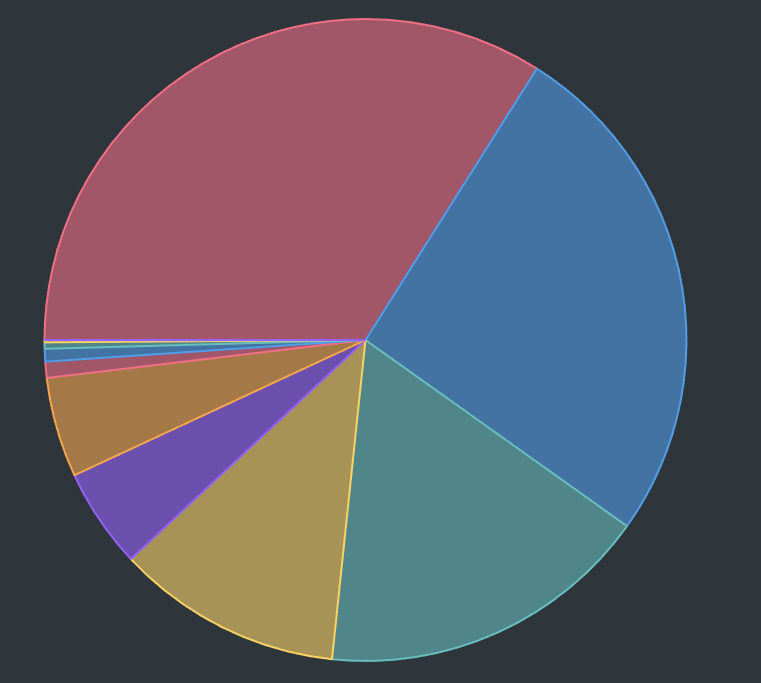

# SQLite DB Plugin for Obsidian

The **SQLite DB Plugin for Obsidian** allows you to interact with SQLite databases directly within your Obsidian vault. You can execute SQL queries, generate charts from your data, inspect table structures, and even export table rows as notes.

---

## Features

- **SQL Query Execution**  
  Write SQL queries in code blocks to fetch and render data from your SQLite database.
- **Natural Results Rendering**  
  See query results rendered as natural lists or in a custom format directly in your note.
- **Multiple Filters & Date Range Filtering**  
  Easily add multiple filter conditions and date ranges to your queries.
- **Chart Visualization**  
  Use the `sql-chart` code block to create charts (pie, line, or bar) based on your data.
- **Table Inspection & Data Export**  
  Inspect table structures and export table rows to new notes.

---

## Installation

1. **Open Obsidian Settings**  
  Navigate to **Community Plugins** and disable **Safe Mode**.
2. **Browse Community Plugins**  
  Search for **SQLite DB Plugin**, then click **Install**.
3. **Enable the Plugin**  
  In your Community Plugins list, enable the plugin.

---

## Configuration

Before using the plugin, set the path to your SQLite database in the plugin settings:
- **Database Path:** Absolute path to your SQLite database file.  
  _Example:_ `/home/user/path/to/database.db`

---

## Usage

### SQL Code Blocks

Create a code block labeled with `sql` to run a SQL query. For example:

```sql
table: Tasks
columns: text, completed, due
filterColumn: completed, priority
filterValue: 0, high
dateColumn: due
startDate: 2024-01-01
endDate: 2024-12-31
orderBy: due
orderDirection: asc
limit: 10
```

This query will:

- Select the `text`, `completed`, and `due` columns from the `Tasks` table.
- Apply two filters: one on `completed` and another on `priority`.
- Filter rows within the specified date range.
- Order the result by the `due` column in ascending order.
- Limit the number of rows to 10.

### Chart Code Blocks

Create a code block labeled with `sql-chart` for visualizations. For example:

```sql-chart
table: Time
chartType: pie
categoryColumn: tag
valueColumn: duration
```



## Query Parameters

Below is a list of available parameters you can use in your SQL blocks:

| Parameter       | Description                                                         | Example                           |
| --------------- | ------------------------------------------------------------------- | --------------------------------- |
| `table`         | **Required.** Name of the table to query.                           | `table: Tasks`                    |
| `columns`       | Comma-separated columns to select.                                  | `columns: id, text, due`            |
| `filterColumn`  | Column(s) to filter on. Can list multiple columns separated by commas.| `filterColumn: completed, priority` |
| `filterValue`   | Filter value(s) for the corresponding columns in `filterColumn`.      | `filterValue: 0, high`              |
| `dateColumn`    | Column containing date information for range filtering.             | `dateColumn: due`                 |
| `startDate`     | Starting date for filtering.                                          | `startDate: 2024-01-01`             |
| `endDate`       | Ending date for filtering.                                            | `endDate: 2024-12-31`               |
| `orderBy`       | Column to order the results by.                                       | `orderBy: due`                    |
| `orderDirection`| Direction of sort (`asc` or `desc`).                                  | `orderDirection: asc`             |
| `limit`         | Maximum number of rows to return.                                     | `limit: 10`                       |

---

## Chart Parameters

| Parameter       | Description                                                         | Example                           |
| --------------- | ------------------------------------------------------------------- | --------------------------------- |
| `chartType`     | Type of chart to create.                                           | `chartType: pie`                    |
| `categoryColumn`| Column to use for the category in the chart.                      | `categoryColumn: priority`         |
| `valueColumn`   | Column to use for the value in the chart.                          | `valueColumn: completed`            |

Each chart takes an optional chartOptions object that can be used to customize the different chart types:

### Line Chart

```sql-chart

table: QuantifiableHabits
chartType: line

xColumn: date
yColumns: value
categoryColumn: habitKey

dateColumn: date
startDate: 2025-01-01
endDate: 2025-01-31

chartOptions: {
	fill: false,
	tension: 0.5,
	pointRadius: 4,
	showLegend: true,
	animations: true,
	yAxisMin: 0,
	yAxisMax: 10
}

```

### Bar Chart

```sql-chart
table: QuantifiableHabits
chartType: bar

xColumn: date
yColumns: value
categoryColumn: habitKey

dateColumn: date
startDate: 2025-01-01
endDate: 2025-01-31

chartOptions: {
    stacked: true,
    horizontal: false,
    showLegend: true,
    animations: true,
    tooltips: true
}
```

### Pie Chart

```sql-chart

table: Money
chartType: pie

categoryColumn: tag
valueColumn: amount

dateColumn: date
startDate: 2025-01-01
endDate: 2025-01-31

chartOptions: {
	showLegend: true,
	isDoughnut: true
}
```